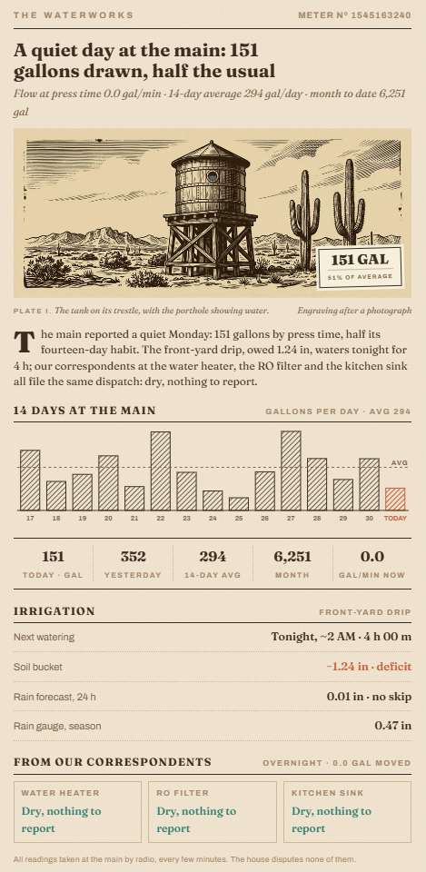

# Homestead Waterworks Card

A water-use news article for a newsprint Home Assistant dashboard — companion to the [Almanac Weather Card](https://github.com/LoneWolf345/almanac-weather-card), the [Network Ledger Card](https://github.com/LoneWolf345/network-ledger-card) and the [Homestead Classifieds Card](https://github.com/LoneWolf345/homestead-classifieds-card).



**What it prints**

- **A woodcut plate** (any image you point it at; five engraved plates ship in [`docs/plates/`](docs/plates)) printed in multiply on the paper, with the day's gallons and percent-of-average on a pasted tag. No plate configured → a vector water-tower scene whose tank fills to the day's draw.
- **A data-driven headline and lede** — "A quiet day at the main: 149 gallons drawn, half the usual" — written from today's draw against the average of the last 14 completed days.
- **Fourteen days at the main** — hatched bar chart from recorder statistics of your meter's `total_increasing` reading, today in terracotta, dashed average line.
- **The ledger strip** — today · yesterday · 14-day average · month · gal/min now.
- **Irrigation** — next watering (from your watering automation's last run plus its cadence, or "Watering now · N min left" while the run timer is active), soil bucket, 24-h rain forecast with the skip verdict, season rain gauge. Built for [Smart Irrigation](https://github.com/jeroenterheerdt/HAsmartirrigation) but any entities with the same meaning work.
- **From our correspondents** — leak pucks filing dispatches ("Dry, nothing to report" / "WATER — reports our correspondent"), the overnight-flow check, and a STOP PRESS band when water is reported.

Read-only: tapping anything opens its more-info dialog.

## Requirements

- A water meter in Home Assistant with a `total_increasing` gallons sensor (here an RTL-SDR reading a Neptune R900 via rtl_433) plus today/month/flow sensors (utility meters).
- Recorder statistics for that sensor (default recorder keeps them).

## Installation (HACS)

1. HACS → Custom repositories → add this repo, category **Dashboard**
2. Install **Homestead Waterworks Card**
3. Copy a plate from `docs/plates/` to `config/www/waterworks/` (or use your own image)
4. Add the card:

```yaml
type: custom:homestead-waterworks-card
meter_entity: sensor.water_meter_reading          # total_increasing, gal — also the statistics id
today_entity: sensor.water_meter_water_today
month_entity: sensor.water_meter_water_this_month
flow_entity: sensor.water_meter_water_flow        # gal/min
meter_number: "1545163240"
plate: /local/waterworks/plate-tank.jpg
plate_caption: The tank on its trestle, with the porthole showing water.
irrigation:
  name: Front-yard drip
  duration_entity: sensor.smart_irrigation_front_yard_drip       # seconds
  bucket_entity: sensor.smart_irrigation_front_yard_drip_bucket  # inches
  rain_entity: sensor.si_rain_forecast_24h                       # inches, next 24 h
  skip_threshold: 0.1
  timer_entity: timer.front_yard_drip
  automation_entity: automation.front_yard_drip_weather_aware_watering
  interval_days: 5
rain_gauge_entity: sensor.rainfall_cumulative
overnight_entity: input_number.water_overnight_leak_gal
leak_entity: input_boolean.water_leak_detected
correspondents:
  - { name: Water heater, entity: binary_sensor.water_heater_leak_flood }
  - { name: RO filter, entity: binary_sensor.ro_filter_leak_flood }
  - { name: Kitchen sink, entity: binary_sensor.kitchen_kitchen_sink_leak_flood }
```

## Options

| Key | Default | Notes |
|---|---|---|
| `meter_entity` | required | `total_increasing` gallons; used for the daily statistics |
| `today_entity`, `month_entity`, `flow_entity` | `''` | Utility-meter sensors; flow in gal/min |
| `meter_number` | `''` | Printed in the kicker as "METER Nº …" |
| `days` | `14` | Completed days in the chart/average |
| `plate` | `''` | Image URL; empty → vector tower scene |
| `plate_number`, `plate_caption`, `plate_credit` | `I`, tank caption, `Engraving after a photograph` | Caption line under the plate |
| `tag_position` | `br` | `br` · `bl` · `tr` · `tl` |
| `irrigation.*` | see YAML | `name`, `duration_entity` (s), `bucket_entity`, `rain_entity`, `skip_threshold`, `timer_entity`, `automation_entity`, `interval_days` |
| `rain_gauge_entity` | `''` | Season total |
| `correspondents` | `[]` | `[{name, entity}]` flood binary sensors |
| `overnight_entity`, `leak_entity` | `''` | Gallons moved overnight; house-wide leak flag (STOP PRESS) |
| `title`, `footer`, `column_rule` | `THE WATERWORKS`, house line, `false` | Kicker, footer, newspaper gutter rule (`--almanac-column-rule`) |

## Theming

Honors `--almanac-paper` (set `transparent` for a one-sheet newspaper look), `--almanac-column-rule`, `--almanac-gutter`, `--ha-card-border-radius` / `--ha-card-box-shadow`. The card remembers its rendered height per device and pins it across re-renders so phones don't jump.

## Plates

`docs/plates/`: `tank.jpg` (the default), `cutaway.jpg` (empty interior — draw your own level), `standpipe-night.jpg`, `monsoon.jpg`, `meter.jpg`. All 912×387, generated as two-color woodcuts (brown ink on cream, a slate-blue spot) and meant to be printed in multiply.
